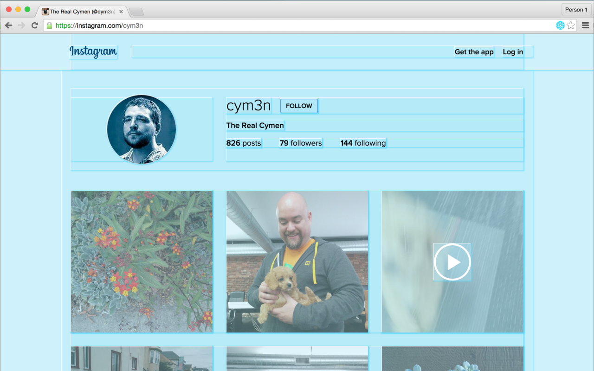

# Show me the React!

Available as:
* [Google Chrome extension](https://chrome.google.com/webstore/detail/show-me-the-react/iaebolhfcmodobkanmaahdhnlplncbnd?hl=en-US&gl=US)
* [Firefox extension](https://github.com/insin/show-me-the-react)

## Chrome extension details 

It is a page action so the icon () only shows up in the URL
bar when the page contains React-managed DOM. It is off by default -- you have to click the icon to highlight the elements rendered/managed by React (and you can click the icon again to toggle the highlight off). You can install this from the [Chrome Web Store](https://chrome.google.com/webstore/detail/show-me-the-react/iaebolhfcmodobkanmaahdhnlplncbnd?hl=en-US&gl=US).

Credit for the original idea goes to someone on Twitter who tweeted a one liner. I can't remember who it was or find it so if someone knows, please let me know.

